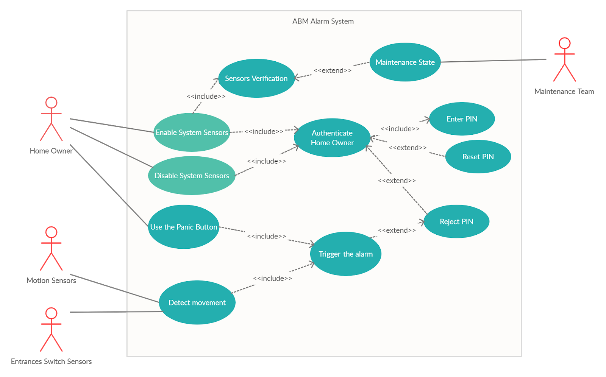

As part of the course ACS233 on System Engineering and Object Oriented Programming, we were tasked to develop a burglar alarm system from inception to delivery. 

# UML

## Activity Diagram

The following is the completed activity diagram

## Class Diagram
The following is the completed class diagram

